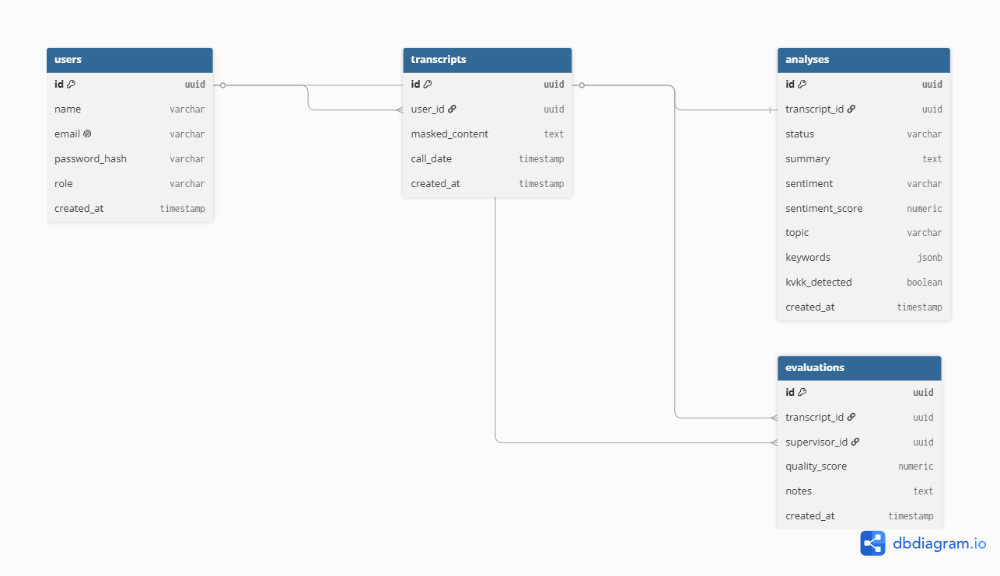

# Veritabanı Şeması
## AI Destekli Çağrı Analiz ve Kalite Kontrol Platformu

**Versiyon:** 0.1 (Gün 3 taslağı)

---

## 1. ER Diyagramı

*(Görsel diyagram dbdiagram.io / drawSQL ile oluşturuldu — bkz. `docs/assets/er-diagram.png`)*

- `users` 1—N `transcripts` (bir agent birden fazla çağrı yükler)
- `users` 1—N `evaluations` (bir süpervizör birden fazla değerlendirme yapar)
- `transcripts` 1—1 `analyses` (her transkriptin tam olarak bir AI analiz sonucu vardır)
- `transcripts` 1—N `evaluations` (bir çağrı zaman içinde birden fazla kez değerlendirilebilir — geçmiş korunur, üzerine yazılmaz)

---

## 2. Tablo Tanımları

### `users`
| Alan | Tip | Açıklama |
|---|---|---|
| id | PK, uuid | Tahmin edilemez ID — enumeration saldırılarına karşı integer yerine tercih edildi |
| name | text | |
| email | text, unique | |
| password_hash | text | Şifre hash'lenerek saklanır (NFR-01) |
| role | enum | `agent`, `supervisor`, `admin` (bkz. gereksinim-analizi.md Bölüm 3) |
| department | text | Örn. "Müşteri Hizmetleri", "Teknik Destek", "Tahsilat" — organizasyonel gruplama için |
| is_active | boolean | Admin kullanıcıyı pasifleştirebilir (silme yerine — geçmiş kayıtlar korunur) |
| created_at | timestamp | |

### `transcripts`
| Alan | Tip | Açıklama |
|---|---|---|
| id | PK, uuid | |
| user_id | FK → users.id | Çağrıyı yapan agent |
| masked_content | text | KVKK maskeleme sonrası hali saklanır (FR-14 kararı — ham veri hiç saklanmaz) |
| call_date | date | **Index gerekli** (FR-13 filtreleme) |
| created_at | timestamp | |

**İndeksler:** `user_id`, `call_date` üzerinde index — FR-13'teki agent ve tarih bazlı filtreleme performansı için.

### `analyses`
| Alan | Tip | Açıklama |
|---|---|---|
| id | PK, uuid | |
| transcript_id | FK → transcripts.id, unique | Bire-bir ilişkiyi garanti eder |
| status | enum | `pending` / `completed` / `failed` — background task'ın durumunu takip eder (bkz. sistem-mimarisi.md, asenkron akış / 202 Accepted) |
| summary | text | |
| sentiment | enum | pozitif / negatif / nötr — **index gerekli** (FR-13) |
| sentiment_score | numeric (0-100) | AI modelinin ham çıktısı (-1.0/+1.0) normalize edilerek saklanır — dashboard ve raporlarda tutarlılık için |
| topic | text | **Index gerekli** (FR-13) |
| keywords | jsonb | |
| kvkk_detected | boolean | |
| created_at | timestamp | Analiz tamamlanma zamanı |

**İndeksler:** `sentiment`, `topic` üzerinde index — FR-13 filtreleme için.

### `evaluations`
| Alan | Tip | Açıklama |
|---|---|---|
| id | PK, uuid | |
| transcript_id | FK → transcripts.id | (unique DEĞİL — 1—N ilişki) |
| supervisor_id | FK → users.id | Puanı veren süpervizör |
| quality_score | numeric (1-100) | FR-15 |
| notes | text | |
| created_at | timestamp | |

> **Neden 1—N?** Bir çağrı, zaman içinde birden fazla kez değerlendirilebilir (örn. kalibrasyon/itiraz süreci). 1—1 yapılsaydı yeni değerlendirme eskisinin üzerine yazılır, geçmiş kaybolurdu.

---

## 3. Normalizasyon Notu

Tüm tablolar en az 3. Normal Form (3NF) kuralına uyacak şekilde tasarlandı:
- Tekrar eden veri yok (örn. agent adı her transkriptte tekrar yazılmıyor, `user_id` ile referans veriliyor)
- Her tablo tek bir konuyu temsil ediyor (`users` sadece kullanıcı bilgisi, `transcripts` sadece çağrı verisi, vb.)

---

## 4. Açık Notlar

- `analyses` tablosu, backend'in AI servisinden aldığı sonucu **arka plan görevi tamamlandığında** yazacağı tablodur (bkz. sistem-mimarisi.md, asenkron akış). Bir transkript oluşturulduğunda `analyses` satırı `status: pending` olarak oluşturulur; AI servisi sonucu döndüğünde `status: completed` (veya hata durumunda `failed`) olarak güncellenir. Frontend, `GET /transcripts/{id}/analysis` ile bu `status` alanını kontrol ederek polling mantığını yönetir.